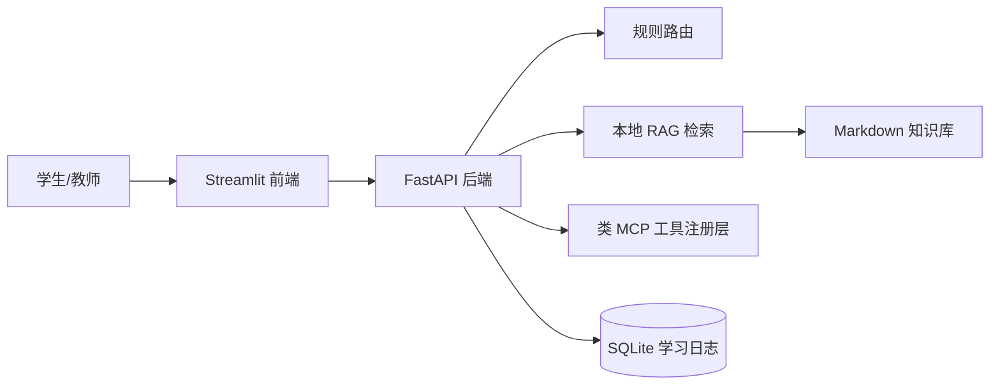

# 系统架构

第一阶段采用本地可演示架构：

```mermaid
flowchart LR
    User[学生/教师] --> Frontend[Streamlit 前端]
    Frontend --> API[FastAPI 后端]
    API --> Router[规则路由]
    API --> RAG[本地 RAG 检索]
    RAG --> KB[Markdown 知识库]
    API --> Tools[类 MCP 工具注册层]
    API --> DB[(SQLite 学习日志)]
```

## 设计原则

- 先跑通本地闭环，再逐步增强。
- 回答应带引用来源。
- 低证据问题应拒答。
- 工具能力统一注册，后续可替换为标准 MCP Server。
